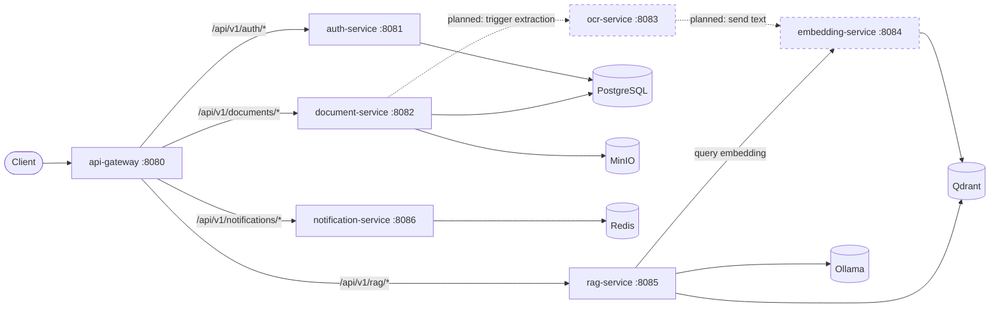

# Architecture

## Overview

`ai-rag-platform` is a microservices monorepo that runs an enterprise RAG (Retrieval-Augmented Generation) stack entirely locally, with no external AI API keys. Every AI capability — LLM inference, embeddings, OCR — runs against a local model server or library.

A single public entrypoint (`api-gateway`) reverse-proxies to six internal services. Services communicate over a private Docker network (`ai-rag-network`); only `api-gateway` is intended to be exposed externally in production.

## Services

| Service | Language | Port | Responsibility |
|---|---|---|---|
| api-gateway | Go (Gin) | 8080 | Public entrypoint; reverse-proxies to auth/document/rag/notification services |
| auth-service | Go (Gin) | 8081 | User registration/login, bcrypt password hashing, JWT issuance |
| document-service | Go (Gin) | 8082 | Document upload/listing; metadata in Postgres, file bytes in MinIO |
| ocr-service | Python (FastAPI) | 8083 | Text extraction from uploaded documents via PaddleOCR |
| embedding-service | Python (FastAPI) | 8084 | Generates bge-m3 embeddings and upserts them into Qdrant |
| rag-service | Go (Gin) | 8085 | Orchestrates retrieval (Qdrant) + generation (Ollama) |
| notification-service | Go (Gin) | 8086 | Publishes async notifications over Redis pub/sub |

## Infrastructure dependencies

| Component | Used by | Purpose |
|---|---|---|
| PostgreSQL | auth-service, document-service | Relational storage: users, document metadata |
| Redis | notification-service | Pub/sub channel for notifications |
| MinIO | document-service | S3-compatible object storage for uploaded files |
| Qdrant | embedding-service, rag-service | Vector storage and similarity search |
| Ollama | rag-service | Local LLM inference (no external API key) |

## Service dependency graph

Dashed edges are wired at the transport level (client libraries/REST calls exist) but the end-to-end document ingestion pipeline (upload → OCR → embed → index) is not yet orchestrated automatically — see [Current scope vs. planned](#current-scope-vs-planned).

## Request flow: authenticated query (current + planned)

See [docs/diagrams/README.md](../diagrams/README.md) for the full sequence diagram.

## Current scope vs. planned

This is Sprint 1 of the roadmap ([ROADMAP.md](../../ROADMAP.md)): repository/infra scaffolding, service skeletons, and CI/CD. Each service is real and independently functional (not mocked), but full cross-service orchestration is intentionally deferred:

- **Implemented now**: auth register/login with real JWT + bcrypt; document upload/list with real Postgres + MinIO writes; notification publish over real Redis pub/sub; OCR extraction via real PaddleOCR; embedding generation + Qdrant upsert via real bge-m3; health/readiness checks that ping real dependencies.
- **Stubbed / planned**: `rag-service`'s `/api/v1/rag/query` returns `501 Not Implemented` — the full pipeline (embed the query, search Qdrant, assemble context, prompt Ollama) is a follow-up sprint. Document upload does not yet automatically trigger OCR → embedding indexing; that orchestration (likely event-driven via Redis or a job queue) is also a follow-up.

## Health checks

Every service exposes `GET /health` (pure liveness — always fast, no dependency calls) used by Docker's `HEALTHCHECK`. Services with real dependencies also expose `GET /health/ready` (pings Postgres/MinIO/Qdrant/Ollama/Redis as applicable, returns `503` if unreachable):

| Service | `/health/ready` checks |
|---|---|
| auth-service | Postgres |
| document-service | Postgres, MinIO |
| rag-service | Qdrant, Ollama |
| notification-service | Redis |

`api-gateway`, `ocr-service`, and `embedding-service` currently expose liveness-only `/health` (the gateway has no direct data dependency; the Python services lazy-load their models on first real request rather than at startup, so there is no meaningful "readiness" state to check beyond process-up).

## Why no API keys

- **LLM inference**: [Ollama](https://ollama.com/) running locally in its own container, serving a locally-pulled model (default `llama3.2`, see `make ollama-pull`).
- **Embeddings**: `BAAI/bge-m3` via `sentence-transformers`, downloaded once from Hugging Face and cached, then run locally on CPU.
- **OCR**: [PaddleOCR](https://github.com/PaddlePaddle/PaddleOCR), also run locally.

No request ever leaves the Docker network to a third-party AI API.
