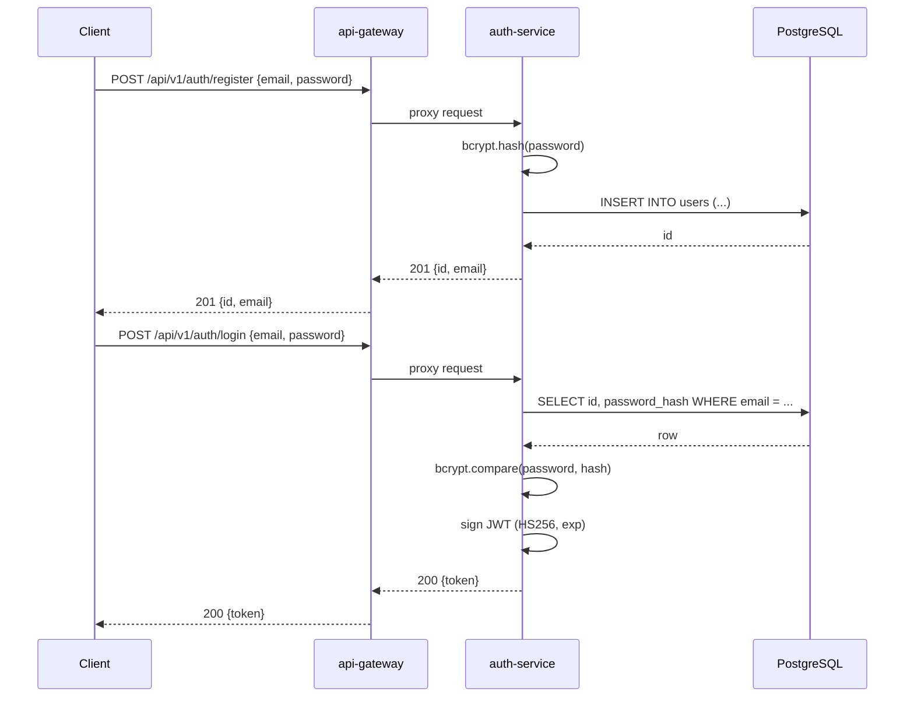
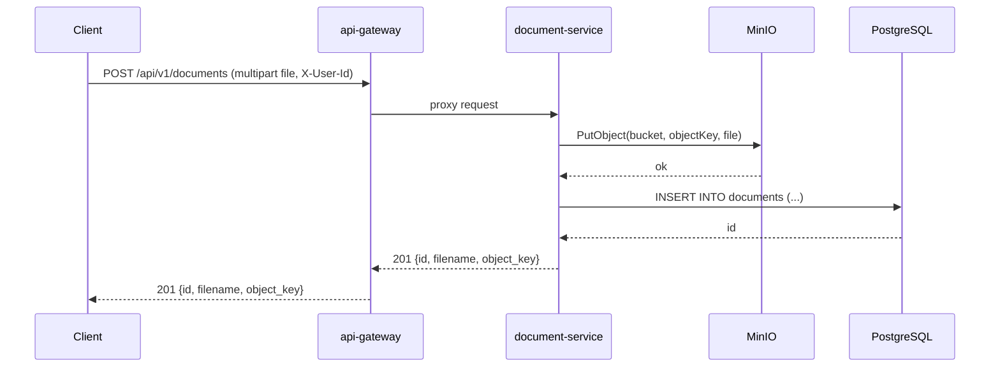
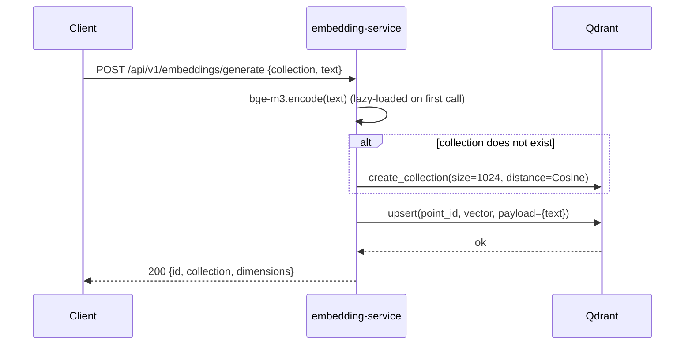
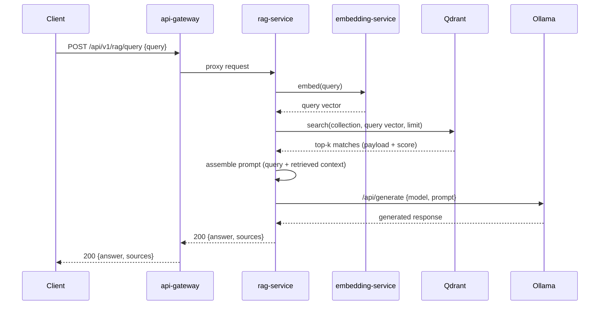
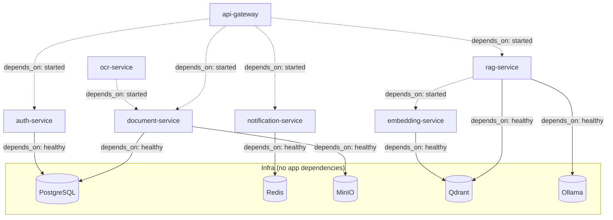

# Diagrams

Diagrams are written as [Mermaid](https://mermaid.js.org/) code blocks so they render directly on GitHub/GitLab without external tooling. See also the service dependency graph in [docs/architecture/README.md](../architecture/README.md).

## Auth: register + login

## Document upload

## Embedding generation

## RAG query — planned pipeline (not yet implemented)

`rag-service`'s `/api/v1/rag/query` currently returns `501 Not Implemented`. This is the intended flow once the full pipeline lands:

## Infra healthcheck dependency order

Solid edges are `condition: service_healthy` (waits for the dependency's healthcheck to pass); dashed edges are `condition: service_started` (waits only for the process to start, since those dependencies expose liveness-only health today).
